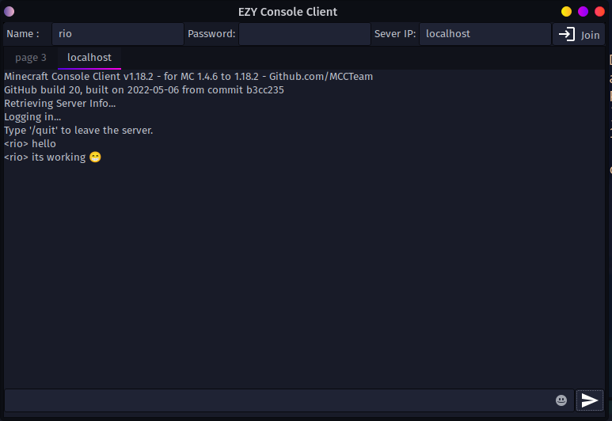

# EZY-Console-Client :computer:
<p align='center'>
 <br>
<br></p>

Frontend Client for [MCC(Minecraft Console Client)](https://github.com/MCCTeam/Minecraft-Console-Client) with support for tabs<br> 
**Works only on linux ATM** (Made in python and GTK)

## Screenshot 


## Installation
# Requirements
* **GTK3**
```
yay -Syyu gtk3 (arch based distro)
apt install libgtk-3-0 (Ubuntu)
dnf install gtk3 (fedora)
```
* **Python3**

## Starting The GUI Application

> Downloading the files 
```
git clone https://github.com/gamerrio/EZY-Console-Client.git
cd EZY-Console-Client
```
> Downloading the MCC Client <br>
 We will use MCC release **20220506-20** instead of **20220816-25** because the new .net binary don't seems to work properly atm<br>

Download this release and put in the same folder as the code [[Release page](https://github.com/MCCTeam/Minecraft-Console-Client/releases/tag/20220506-20)]
```
wget https://github.com/MCCTeam/Minecraft-Console-Client/releases/download/20220506-20/MinecraftClient.exe
```
> Run **main.py**
```
python3 main.py
```
Now you can fill the required entries and client should work as expected.